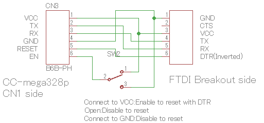
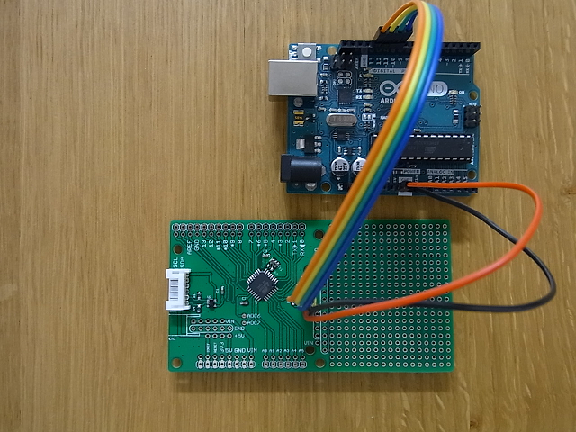

Burn Bootloader and upload a program for CC-mega328 Breakout Board
========================================

First of all
--------------
You will need the following items for this instruction.
 - Arduino UNO or AVR-ISP and more.
 - FTDI BREAKOUT BOARD(5.0V)
 - reprogramming cable(you should assebele it.)

Software Setup
--------------
No requirements

Hardware Setup
--------------
Refer to the figure below to make reprogramming cable.  

### Connection
The ICSP connector is available on this board.
For example, the following figure is connection with Arduino UNO ISP.  

Burn Bootloader and Upload a program
--------------
Burning the Bootloader is same way as original Arduino UNO.  

### Upload a program
Before you upload your program, please check whether the switch(reprogramming cable) position is tied low(GND).  
The bootloader check port condtion when turn on itself.  
Click the Upload button in the IDE. Wait a few seconds. If successful, the message "Done uploading." will appear in the status bar.
